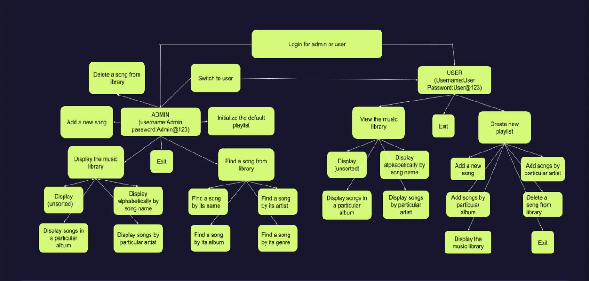

# SpotifyPlaylist

## Features

### ADMIN Mode

In ADMIN mode, the following actions can be performed:

- Add a new song to the default playlist.
- Display the entire playlist using Merge sort on Linked Lists.
- Search for a song in the playlist.
- Delete a song from the playlist.

### USER Mode

In USER mode, the following actions can be performed:

- View the existing music library.
- Create a personal playlist.
- Add new songs to the personal playlist.
- Add songs from the default playlist based on Artist or Album.
- Delete songs from the personal playlist.

## Installation

1. Clone the repository:

   ```bash
   git clone https://github.com/your/repo.git
   
## Acknowledgements

- This application is inspired by the need for a simple music management system.
- The merge sort algorithm used for sorting the playlist is based on Merge Sort.



